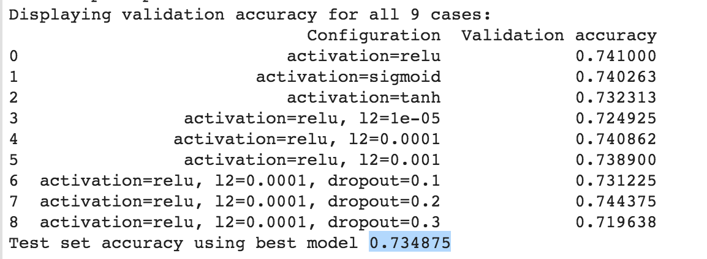

# Assignment 4
## Name: Hardik Sahi | WatID: 20743327

The classification accuracy table for different scenarios is as follows:

Test accuracy using best model: 0.734875

## Question: What effect do activation functions have on your results?

As it is clear from the table above, **relu** activation function results in a model that has best validation accuracy. Different activation functions provide different non-linearities. The biggest advantage of **ReLu** is non-saturation of its gradient, which greatly accelerates the convergence of stochastic gradient descent compared to the sigmoid / tanh functions. [1]

## Question: What effect does addition of L2-norm regularization have on the results?

The L-2 regularization is defined by parameter (lambda). This regularization technique forces the learnt weights to get closer to zero (but not zero) by penalizing high weigh values.

**Low value of lambda**: Complex model, low bias and high variance. Model risks overfitting (model starts learning training data and performs badly on unseen data.). 

**High value of lambda**: Simpler model, high bias and low variance. Model risks underfitting (model does not learn features from training data).

The idea is to choose a value of lambda such that model neither overfits nor underfits. As can be seen from the above table, such value is **lambda = 0.0001**. Further **lower value (0.00001) leads to overfitting** and further **higher value (0.001) leads to underfitting**.

## Question: What effect does dropout have on the results?

Dropout is a regularization technique that basically functions as ensemble of multiple neural network models. This is done by randomly dropping out nodes of the network defined by neuron turn-off dropout probability ( p ).

This is generally used to prevent overfitting and hence improve generalizability of the model by reducing interdependent learning amongst the neurons.

As can be seen from the table above, validation accuracy maximizes at **p=0.2**. The val accuracy decreases both on further increasing or decreasing p value.

Overall best model that performs on testing dataset is achieved by introducing L2 regularization + dropout regularization.

## REFERENCES
1. https://datascience.stackexchange.com/questions/23493/why-relu-is-better-than-the-other-activation-functions

